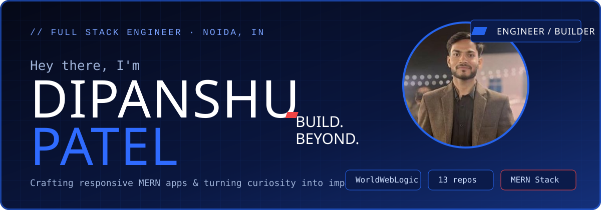
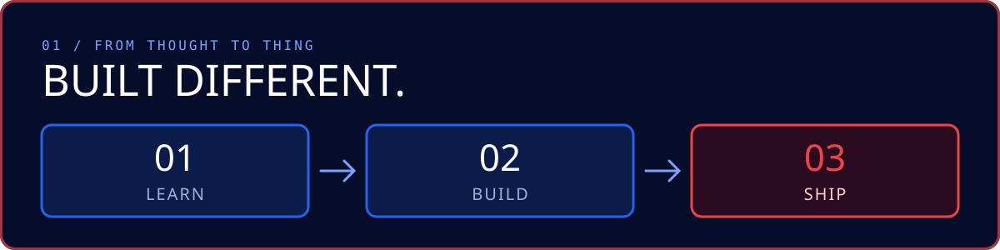

## 👋 About Me

MERN Stack Developer with **1+ year of experience** delivering **4 production MERN applications** for live clients in **e-commerce, logistics, and HR**. I work across the stack: React UI, REST APIs, and MongoDB, with JWT auth and role-based access control, Stripe payments, third-party delivery APIs, and real-time features using Socket.io.

- 💼 Junior Web Developer at **WorldWebLogic Pvt. Ltd**, Noida
- 📍 Noida, Uttar Pradesh, India
- 🎯 Seeking a **MERN Stack / React Developer** role to build scalable, user-focused products

## ⚡ Tech Stack

## 🚀 Featured Projects

<table>
<tr>
<td width="50%" valign="top">

### 👓 Atal Opticals: E-Commerce
Production store for a sunglasses retailer, live with real customers. 3 categories, 14 subcategories, cart, and secure **Stripe** checkout. **Loomis** delivery API for shipping. Redux + Context API, lazy loading.
`React` `Redux` `Node` `Express` `MongoDB` `Stripe`
[🔗 Live: ataloptical.org](https://ataloptical.org)

</td>
<td width="50%" valign="top">

### 🏢 HRMS
Enterprise HR system with **15–20 modules** (attendance, leave, announcements, tasks, activity tracking), used by 13 employees. Admin / HR / Employee dashboards, real-time notifications with **Socket.io**, and an **Electron.js** desktop client.
`React` `Node` `Express` `MongoDB` `Socket.io` `Electron` `JWT`
[🔗 Live: wwlhrms.digitalwebguider.com](https://wwlhrms.digitalwebguider.com)

</td>
</tr>
<tr>
<td valign="top">

### 🚢 Gulf Worldwide Logistics: Dashboard
Full dashboard to manage import-export shipping operations, with role-based access for **5 user roles**: Customer, Employee, Admin, Lower Manager, Super Manager. Shipment tracking and operational workflows.
`React` `Node` `Express` `MongoDB`

</td>
<td valign="top">

### 🌐 Digital WebGuider: IT Company Website
Fully responsive IT company site with reusable components. Lazy loading for speed, with Lighthouse scores of **100 (Best Practices)** and **91 (SEO)**.
`React` `Tailwind` `React Router` `Vite`
[🔗 Live: digitalwebguider.com](https://digitalwebguider.com)

</td>
</tr>
</table>

## 💼 Experience

**Junior Web Developer** · WorldWebLogic Pvt. Ltd, Noida · *Sep 2025 – Present*
- Built and deployed 4 MERN applications for live clients: UI, REST APIs, and database
- Integrated Stripe and Loomis APIs with React using Axios; managed state with Redux and Context API
- Improved load performance with lazy loading; implemented JWT auth and role-based access control

**Junior Web Developer Intern** · WorldWebLogic Pvt. Ltd · *May 2025 – Aug 2025*
- Worked on live client projects under senior mentorship; converted to full-time based on performance

## 🎓 Education & Certifications

- **B.Tech in Computer Science**, Maharaja Agrasen College of Engineering and Technology, Amroha (AKTU) · 2020 – 2024 · CGPA 7.44/10
- **React.js Training**, Ducat India · Jul – Dec 2024
- **JavaScript Certification**, KG Coding · Jun 2024

## 📊 GitHub Stats

### 📬 Open to MERN Stack / React Developer roles
[dipanshupatel857@gmail.com](mailto:dipanshupatel857@gmail.com)

